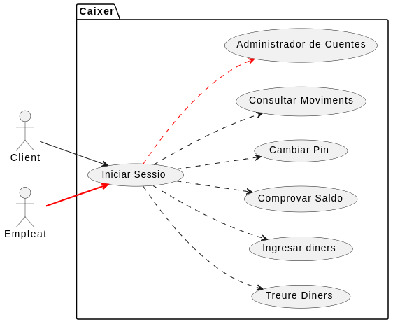

# M05_UML
M05_UML Carlos Jiménez Viso 

Classes Python: Cada classe UML s'ha convertit en una classe Python amb els seus respectius atributs i mètodes. Les classes es mantenen bastant semblants a la descripció en UML, amb cada atribut representat com una variable d'instància i cada mètode representat com una funció dins de la classe.

Relacions entre classes: Les relacions entre classes, com associacions, composicions i agregacions, s'han implementat a través dels atributs de les classes. Per exemple, a la classe Factura, l'atribut client és una instància de la classe Client, representant la relació d'associació entre Factura i Client.

Ús de datetime: S'ha importat el mòdul datetime per treballar amb dates i hores.

Instàncies de classes: S'han creat instàncies de les classes amb valors específics pels atributs, seguint la lògica del model UML.

En resum, la conversió del diagrama UML a Python implica traduir les entitats i relacions del diagrama en classes i atributs en Python, mantenint la lògica i les relacions definides en el model UML.
